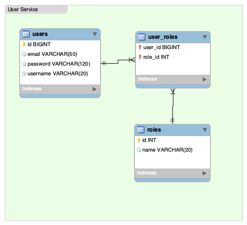
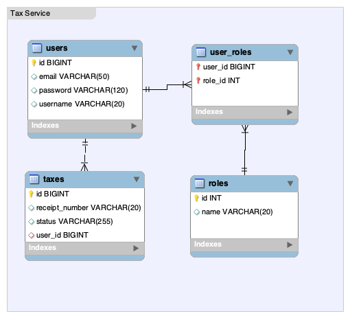
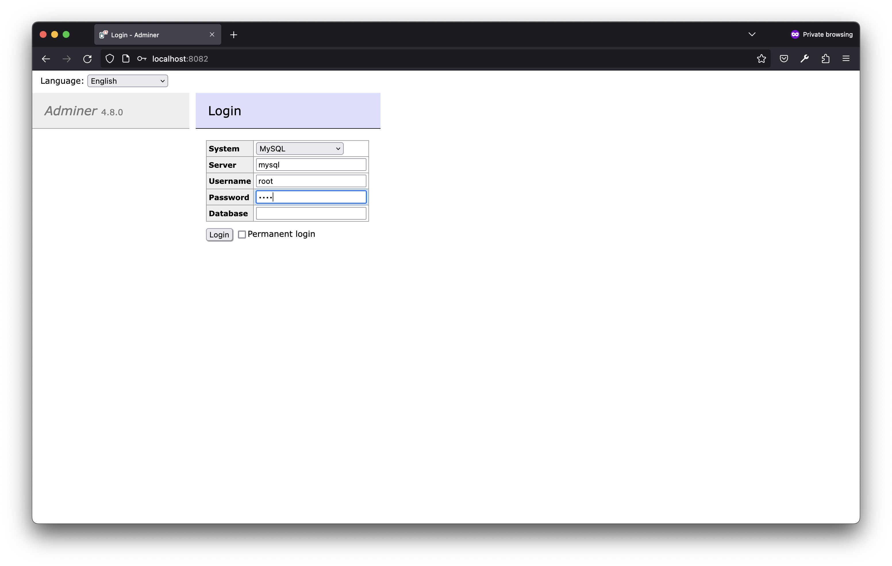
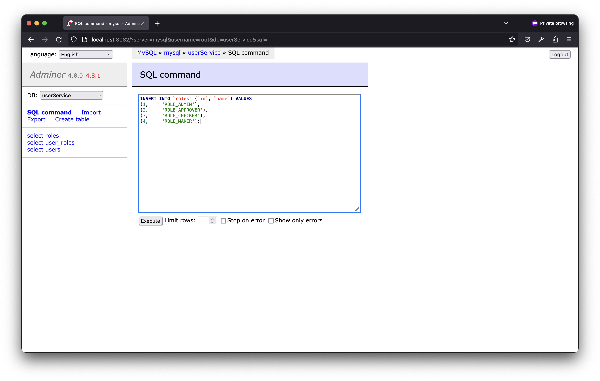
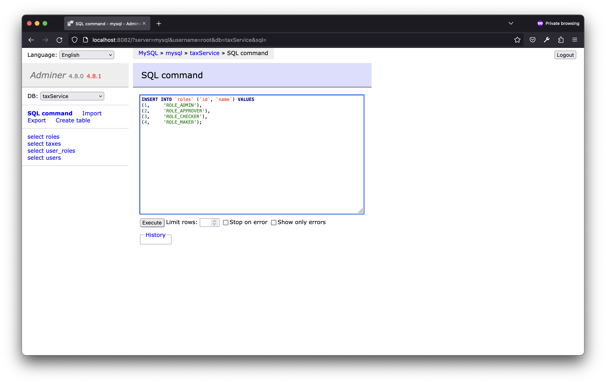
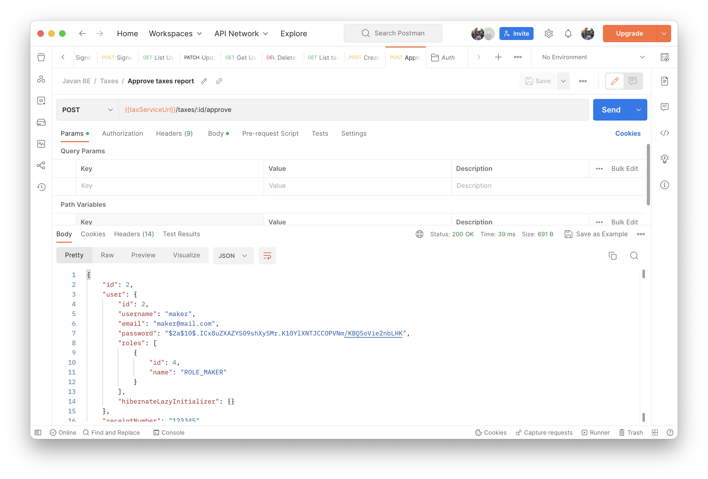

# Javan BE

## Daftar Isi 
1. [Ringkasan](#ringkasan)
2. [Desain Database](#desain-database)
3. [Running the App](#running-the-app)
4. [Testing](#testing-using-postman)

## Ringkasan 

1. Perusahaan A membutuhkan aplikasi pelaporan pajak yang terdiri dari modul user management
dan modul pelaporan pajak
2. Modul user management mampu melakukan CRUD akun perorangan :
email, password, role : user dan admin
yang dapat melakukan CRUD instance user hanya admin
3. Modul pelaporan pajak mampu melakukan input laporan pajak :
nomor resi, tanggal pembuatan, status,
4. Role user terdiri dari maker, checker dan approver, laporan pajak hanya bisa diinput oleh user
maker,
user checker hanya bisa melihat laporan pajak yang telah di submit oleh user maker
user checker dapat mengapprove atau me reject laporan pajak
user approver hanya bisa melihat laporan pajak yang telah di approve oleh checker
5. Modul user management dan pelaporan pajak adalah 2 service yang terpisah dan dihubungkan
menggunakan konsep microservice
6. Anda adalah fullstack developer perushaaan A, buatlah skema diagram database apps tersebut

Tech stack :

Test API menggunakan postman
BE : Java Springboot, RabbitMQ
DB: MySQL

## Desain Database 

Aplikasi ini di bagi menjadi dua buah service, setiap service menggunakan database tersendiri. 

Berikut desain database nya.





## Running the App
### Cloning repo 

Untuk bisa menjalankan aplikasi ini diperlukan beberapa software yang harus diterinstall di komputer local anda, diantaranya:
- Docker
- Docker Compose

Setelah requirement diatas terpenuhi, untuk melakukan setup awal, pastikan Anda telah melakukan cloning projek ini.

Setelah anda cloning, repo ini, buka terminal pada komputer anda dan masuk ke folder repo ini:
```
cd javanBackend
```

### Start Server using Docker Compose 

Untuk menjalankan aplikasi yang ada dalam projek ini, cukup jalankan perintah:
```
docker compose up -d
=> ⠿ Container javanbackend-mysql-1        Running                                                                                        0.0s
=> ⠿ Container javanbackend-taxservice-1   Running                                                                                        0.0s
=> ⠿ Container javanbackend-rabbitmq-1     Running                                                                                        0.0s
=> ⠿ Container javanbackend-userservice-1  Running                                                                                        0.0s
=> ⠿ Container javanbackend-adminer-1      Running 

docker compose ps # untuk melihat status dari `running container`
=> javanbackend-adminer-1       adminer:4.8.0                  "entrypoint.sh docke…"   adminer             25 minutes ago      Up 25 minutes       0.0.0.0:8082->8080/tcp
=> javanbackend-mysql-1         mysql:8.0                      "docker-entrypoint.s…"   mysql               25 minutes ago      Up 25 minutes       0.0.0.0:3306->3306/tcp, 33060/tcp
=> javanbackend-rabbitmq-1      rabbitmq:3-management          "docker-entrypoint.s…"   rabbitmq            25 minutes ago      Up 25 minutes       4369/tcp, 5671-5672/tcp, 15671/tcp, 15691-15692/tcp, 25672/tcp, 0.0.0.0:15672->15672/tcp
=> javanbackend-taxservice-1    kacestudio/javan-taxservice    "java -jar tax-0.0.1…"   taxservice          25 minutes ago      Up 25 minutes       0.0.0.0:8081->8080/tcp
=> javanbackend-userservice-1   kacestudio/javan-userservice   "java -jar user-0.0.…"   userservice         25 minutes ago      Up 25 minutes       0.0.0.0:8080->8080/tcp
```

### Setup init database value

Setelah aplikasi running, kita harus melakukan setup init databases master data menggunakan adminer. 
Kita dapat mengakses url `http://localhost:8082` untuk bisa mengakses instance database mysql.

Pastikan mekakukan eksekusi query berikut di dua database yang kita gunakan yaitu `taxService` dan `userService`;

```
INSERT INTO `roles` (`id`, `name`) VALUES
(1,	'ROLE_ADMIN'),
(2,	'ROLE_APPROVER'),
(3,	'ROLE_CHECKER'),
(4,	'ROLE_MAKER');
```

Berikut contoh tampilannya.





## Testing using Postman

Untuk melakukan testing api, pastikan Anda sudah melakukan import [Javan BE Postman Collection](docs/postman/Javan%20BE.postman_collection.json) yang ada pada folder docs di repository ini.


